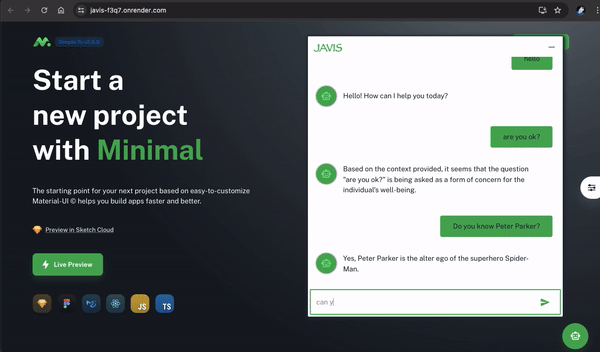

#  Chatbot Javis 🦜 
 - OpenAI + GoogleAI + Langchain + React + Nestjs + Oauth2 [Google - Facebook - Github]
 - For some security reasons, this resource has to keep the Back-end development repo private.
 - Check out [Nestjs backend](https://github.com/DinhQuocDat1310/side_project_ecom)
## Demo

### Install (node 16.13.0) (yarn 1.22.19)
    yarn install
    yarn start
### Config .env :
    FAST_REFRESH=false
    PORT=3000
    REACT_APP_FIREBASE_API_KEY=
    REACT_APP_FIREBASE_AUTH_DOMAIN=
    REACT_APP_FIREBASE_PROJECT_ID=
    REACT_APP_FIREBASE_STORAGE_BUCKET=
    REACT_APP_FIREBASE_MESSAGING_SENDER_ID=
    REACT_APP_FIREBASE_APPID= 
    REACT_APP_FIREBASE_MEASUREMENT_ID=
    REACT_APP_FIREBASE_DATABASE_URL=
    
    REACT_APP_GOOGLE_CLIENT_ID=
    REACT_APP_GOOGLE_SECRET_KEY=
    
    REACT_APP_REDIRECT_URL=http://localhost:3000
    REACT_APP_GITHUB_REDIRECT_URL=http://localhost:3000/dashboard
    
    REACT_APP_GITHUB_CLIENT_ID=
    REACT_APP_GITHUB_CLIENT_SECRET=
    
    REACT_APP_BACKEND_HOST=http://localhost:4000/graphql

    
### [Open ID Connect](https://developers.google.com/identity/openid-connect/openid-connect) :
  - check out docs [here](src/components/authentication/login/LoginForm.tsx#L96)

### Chatbot :
  - [Additional Google AI Gemini-pro model] Open AI Chatbot using langchain.
  - Prepare OPEN_API_KEY.
  
### Contact me [Finn](mailto:chien.170901@gmail.com) or [Axcel](datdinhquoc1310@gmail.com) for backend server.
